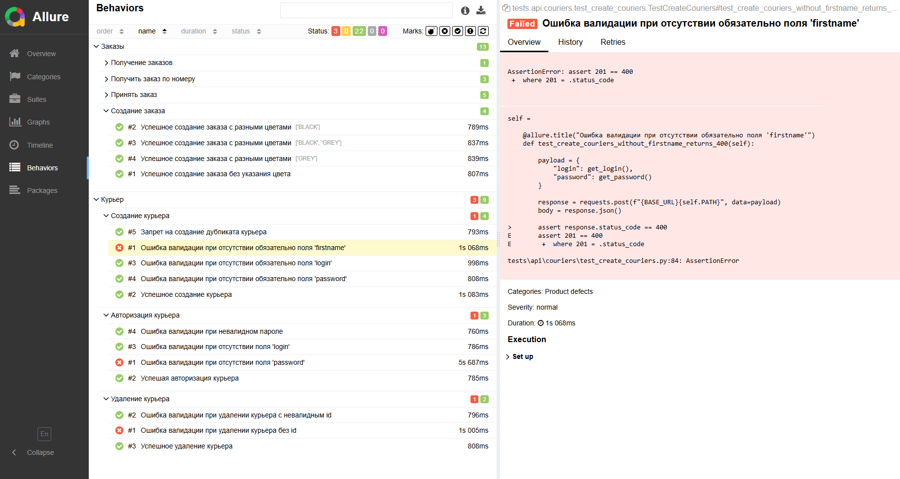

# Sprint 7 — Автотесты API сервиса «Яндекс.Самокат»

## Описание

Проект содержит API-автотесты для тестового стенда сервиса **«Яндекс.Самокат»**.
Тесты покрывают эндпоинты управления курьерами и заказами.

**Стек:** Python · pytest · requests · allure-pytest · Faker · pytest-xdist

---

## Структура проекта

```
Sprint_7/
├── conftest.py              # Общие фикстуры
├── setting.py               # Базовый URL
├── pytest.ini               # Конфигурация pytest
├── requirements.txt         # Зависимости
├── helpers/
│   └── generate_data.py     # Генерация тестовых данных (Faker)
└── tests/
    └── api/
        ├── couriers/
        │   ├── test_create_couriers.py      # создание курьера
        │   ├── test_login_couriers.py       # авторизация курьера
        │   └── test_delete_courier.py       # удаление курьера
        └── orders/
            ├── test_create_order.py         # создание заказа
            ├── test_accept_order.py         # принятие заказа
            ├── test_get_orders.py           # список заказов
            └── test_get_order_by_number.py  # заказ по номеру
```

---

## Покрытие тестами

| Компонент | Эндпоинт | Метод | Тестов |
|---|---|---|:---:|
| Создание курьера | `/api/v1/courier` | POST | 5 |
| Авторизация курьера | `/api/v1/courier/login` | POST | 5 |
| Удаление курьера | `/api/v1/courier/{id}` | DELETE | 3 |
| Создание заказа | `/api/v1/orders` | POST | 2 |
| Принятие заказа | `/api/v1/orders/accept/{id}` | PUT | 5 |
| Список заказов | `/api/v1/orders` | GET | 1 |
| Заказ по номеру | `/api/v1/orders/track` | GET | 3 |
| **Итого** | | | **24** |



---

## Установка

### Требования

- Python 3.8+
- [Allure CLI](https://allurereport.org/docs/install/) (для просмотра отчёта)

### Шаги

```bash
# 1. Клонировать репозиторий
git clone <repo-url>
cd Sprint_7

# 2. Создать и активировать виртуальное окружение
python -m venv .venv

# Windows
.venv\Scripts\activate

# Linux / macOS
source .venv/bin/activate

# 3. Установить зависимости
pip install -r requirements.txt
```

---

## Запуск тестов

```bash
# Все тесты (параллельно, согласно pytest.ini)
pytest

# Все тесты с генерацией Allure-отчёта
pytest --alluredir=allure-results

# Конкретный модуль
pytest tests/api/couriers/test_create_couriers.py --alluredir=allure-results

# Без параллелизма (для отладки)
pytest -p no:xdist --alluredir=allure-results

# С выводом в консоль
pytest -v --alluredir=allure-results
```

---

## Просмотр Allure-отчёта

```bash
# Открыть отчёт в браузере
allure serve allure-results

# Или: сгенерировать статику и открыть вручную
allure generate allure-results -o allure-report --clean
allure open allure-report
```

> Команда `allure serve` автоматически поднимает локальный сервер и открывает браузер.

---

## Конфигурация

| Файл | Параметр | Значение |
|---|---|---|
| `setting.py` | `BASE_URL` | `https://qa-scooter.praktikum-services.ru` |
| `pytest.ini` | `addopts` | `-n auto` (авто-параллелизм) |
| `pytest.ini` | `disable_test_id_escaping_...` | `True` (поддержка кириллицы) |

---

## Зависимости

```
pytest==9.0.2
requests==2.32.5
allure-pytest==2.15.3
allure-python-commons==2.15.3
faker
pytest-xdist==3.8.0
```
